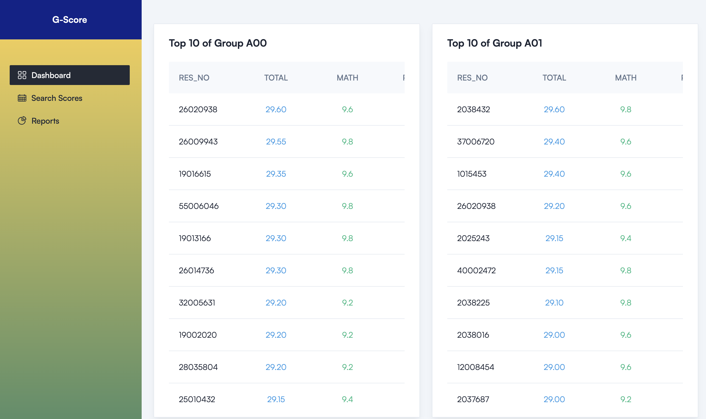
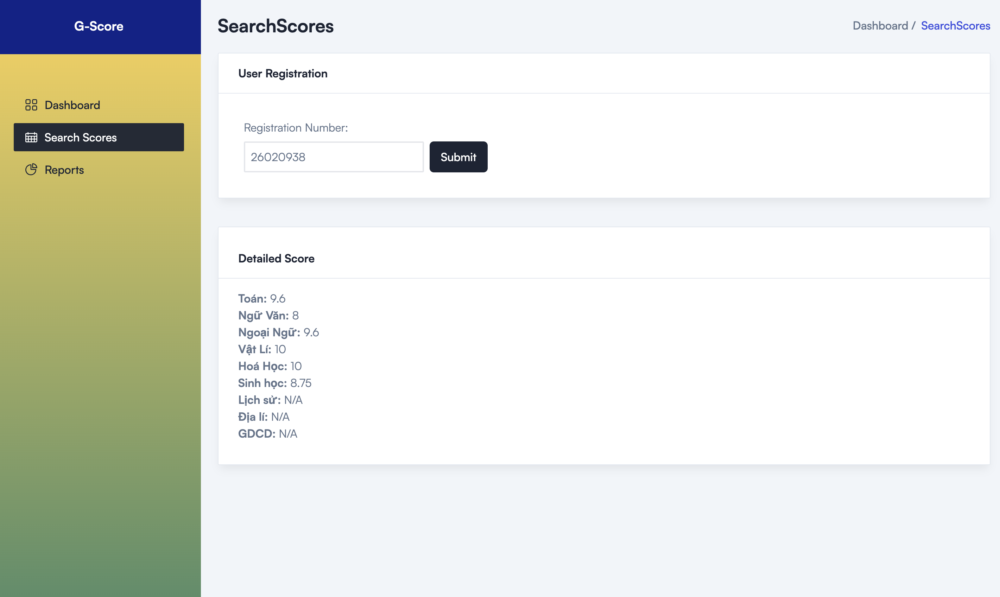
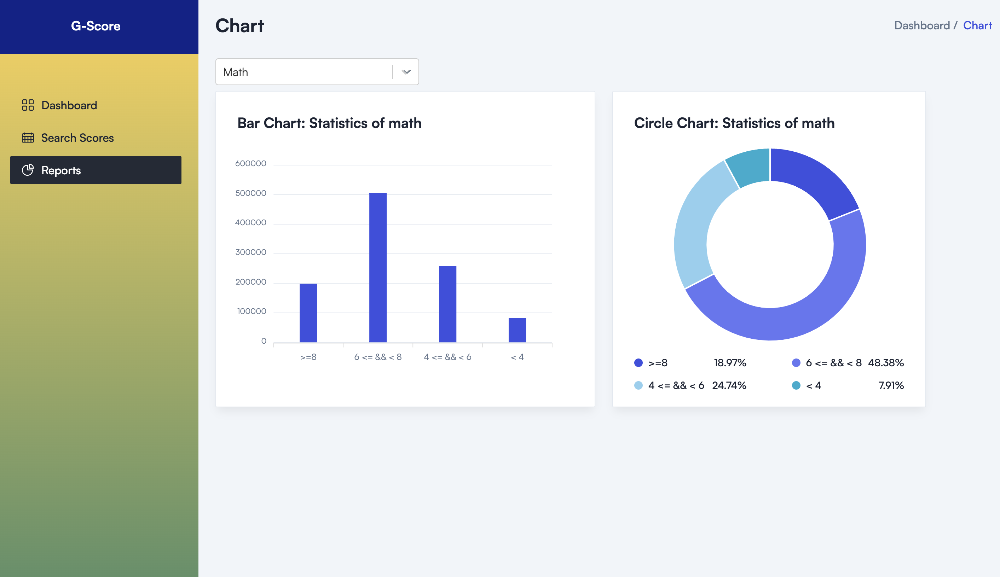

## Reference source

- TailAdmin: Tải [tại đây](https://tailadmin.com/)

## Enviroments

- Node.js: >=v14.16+

## Run

- Then run : <code>npm install</code>

- Then run : <code>npm run dev</code>

Now, in the browser go to <code>localhost:5173</code>

## Build

**For Production Build**
Run : <code>npm run build</code>

## Deploy

- Using Netlify: https://www.netlify.com/
- Link Deployed: https://gscore-gold.netlify.app/

## Application

